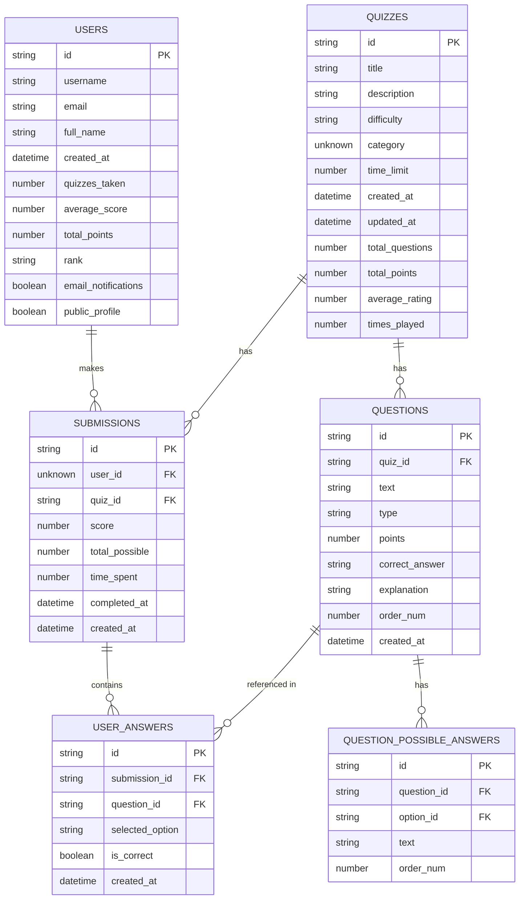

# Database Diagram

```mermaid
erDiagram
    USERS {
        string id PK
        string username
        string email
        string full_name
        datetime created_at
        number quizzes_taken
        number average_score
        number total_points
        string rank
        boolean email_notifications
        boolean public_profile
    }
    
    QUIZZES {
        string id PK
        string title
        string description
        string difficulty
        unknown category
        number time_limit
        datetime created_at
        datetime updated_at
        number total_questions
        number total_points
        number average_rating
        number times_played
    }
    
    QUESTIONS {
        string id PK
        string quiz_id FK
        string text
        string type
        number points
        string correct_answer
        string explanation
        number order_num
        datetime created_at
    }
    
    QUESTION_POSSIBLE_ANSWERS {
        string id PK
        string question_id FK
        string option_id FK
        string text
        number order_num
    }
    
    SUBMISSIONS {
        string id PK
        unknown user_id FK
        string quiz_id FK
        number score
        number total_possible
        number time_spent
        datetime completed_at
        datetime created_at
    }
    
    USER_ANSWERS {
        string id PK
        string submission_id FK
        string question_id FK
        string selected_option
        boolean is_correct
        datetime created_at
    }
    
    QUIZZES ||--o{ QUESTIONS : "has"
    QUESTIONS ||--o{ QUESTION_POSSIBLE_ANSWERS : "has"
    USERS ||--o{ SUBMISSIONS : "makes"
    QUIZZES ||--o{ SUBMISSIONS : "has"
    SUBMISSIONS ||--o{ USER_ANSWERS : "contains"
    QUESTIONS ||--o{ USER_ANSWERS : "referenced in"
```

View this file with a Markdown viewer that supports Mermaid diagrams.